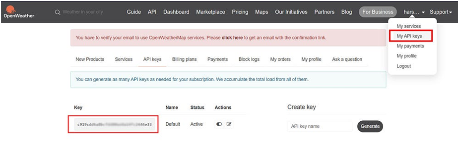

# Create the weather-app-react
> Steps to be followed

> Step 1: Create an OpenWeatherMap Account and Generate  API Key

Visit the OpenWeatherMap website (https://openweathermap.org/) and click on "Sign Up" or "Log In" to create an account or log into your existing account.
Once logged in, navigate to your account dashboard.
From the dashboard, locate my  API Keys section and click on "Create Key" or "API Keys" to generate a new API key.
Provide a name for your API key (e.g., "WeatherApp") and click on the "Generate" or "Create" button.
Your API key will be generated and displayed on the screen. Make sure to copy it as we will need it later.
Locate  API key

> Step 2:

```shell
cd weather-app-react
```
> Step 3:

src/WeatherService.js > Replace with your api key > at line number 4.

> Step 4:
```shell
npm install or npm i

npm start
```